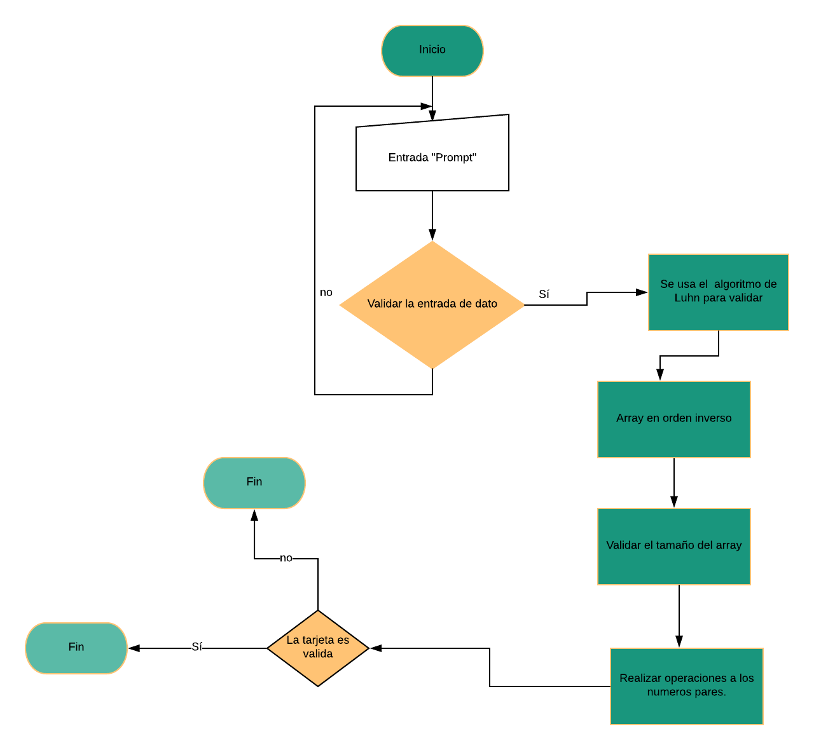

# TARJETA DE CRÉDITO VÁLIDA
Por medio de un prompt(), ingresar los 16 digitos del número de una tarjeta de crédito y confirme su validez según el algoritmo de Luhn.
>*Consideraciones Específicas:*
>Tu código debe estar compuesto por una función: isValidCard.
>El usuario no debe poder ingresar un campo vacío
## Algoritmo de Luhn.
También conocida como "algoritmo de módulo 10", es una fórmula de suma de verificación, utilizada para validar una diversidad de números de identificación; como números de tarjetas de crédito, números IMEI, etc.

## Pasos a seguir

1. Algoritmo de Luhn, esto se empleara para validar que el numero de tarjeta de credito sea falso.
2. Se pasaran los numeros a un array en orden inverso.
3. Se validara el tamaño del array(lenght).
4. Se aplicaran las operaciones a los numeros pares.

